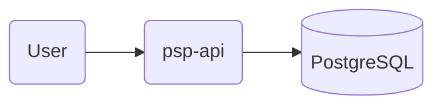
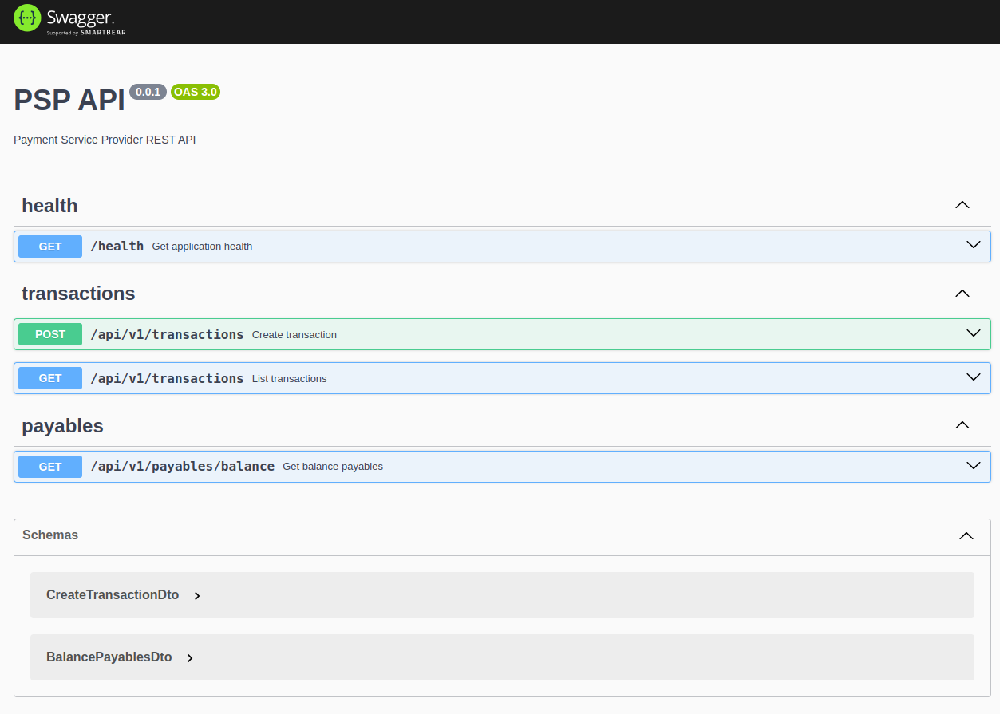

# psp-api

A Nest.js project for a simplified Payment Service Provider (PSP). For more information about the coding challenge, please read [CHALLENGE.md](./CHALLENGE.md) or access this [link](https://github.com/pagarme/vagas/blob/master/desafios/software-engineer-backend/README.md).

## Context

At its core, a PSP has two very important functions:

1. Allow customers to process transactions (`cash-in`).
2. Make payments of receivables to customers (`cash-out`).

## Architecture



## Dependencies

This project utilizes the following technologies and dependencies:

- [Node.js 20.9.0](https://nodejs.org/)
- [Nest.js](https://nestjs.com/)
- [Docker](https://www.docker.com/)
- [PostgreSQL](https://postgresql.org/)
- [Prisma ORM](https://www.prisma.io/)
- [Pino](https://getpino.io/)

Make sure to have these dependencies installed to successfully run the project.

## Installation

```bash
$ npm install
```

## Running the app

```bash
# development
$ make start

# watch mode
$ make start-dev

# production mode
$ make start-prod
```

## Prisma ORM

```bash
# open prisma studio
$ make prisma-studio

# create migration
$ npx prisma migrate dev --name <migration_name>
```

## Test

```bash
# unit tests
$ make test

# e2e tests
$ make test-e2e

# test coverage
$ make test-cov
```

## API Endpoints

You can view the entire API documentation through the Swagger endpoint: [localhost:8080/swagger](http://localhost:8080/swagger)



- Create transaction:

```bash
curl -X POST http://localhost:8080/api/v1/transactions \
-H "Content-Type: application/json" \
-d '{
    "userId": 1,
    "value": 1.99,
    "description": "Smartband XYZ 3.0",
    "paymentMethod": "debit_card",
    "cardNumber": "4111111145551142",
    "cardHolder": "Ozzy Osbourne",
    "cardExpiry": "12/23",
    "cvv": "737"
}'
```

- List transactions:

```bash
curl http://localhost:8080/api/v1/transactions
```

- Get balance payables:

```bash
curl 'http://localhost:8080/api/v1/payables/balance' \
-H 'userId: 1'
```

- Get application health:

```bash
curl http://localhost:8080/health
```

## Contributing

If you'd like to contribute to this project, please follow these guidelines:

1. Fork the repository.
2. Create a new branch for your feature or bug fix.
3. Make your changes and ensure that the existing tests still pass.
4. Add new tests for any new features or changes you make.
5. Submit a pull request to the main repository.

Happy coding!

## Author

- [Matheus Bosa](https://www.linkedin.com/in/matheusfbosa/)
